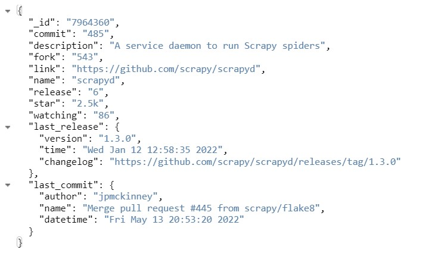

# Repository data collector

- Collects the following data using Scrapy for each link: repository name, description, link, number of stars, number of forks, number of watching, number of commits, info about the latest commit (author, name, UTC datetime),  number of releases, info about the latest release (version, creation UTC datetime, changelog) 
- Stores data in MongoDB database

## Installation

```sh
pip install scrapy
pip install pymongo
```
## Usage
1. make sure you are in scrapy_task folder
2. scrapy crawl reviewspider -a start_urls=<file_name1,file_name2,...>

## Example
1. scrapy crawl reviewspider -a start_urls="https://github.com/scrapy,https://github.com/celery/"
2. scrapy crawl reviewspider -a start_urls="https://github.com/scrapy"

## Project

### items.py

The main goal of scraping is to extract unstructured data and convert it to meaningful, structured data.
There are several dataclasses: 
1. GithubItem, which contains information about repository id, name, description, link, number of stars, number of forks, number of watching, number of commits,  number of releases.
2. CommitInfo, which contains information about author, name, UTC datetime of the latest commit.
3. ReleaseInfo, which contains information about version, creation UTC datetime, changelog of the latest release.

### reviewspider.py 

First of all, the parse() method looks for the link view all. After extracting the data from the first page, the parse() method looks for the link to the next page and yields a new request to the next page, registering itself as callback to handle the data extraction for the next page and to keep the crawling going through all the pages. 
The process of extracting data from the page is as follows: visit repositories to yield GithubItem from them, then proceed to extra links to extract information about the latest commit and release.

### pipelines.py

My data model uses embedded documents to describe a one-to-one relationship between connected data. It can reduce the number of read operations required to obtain data:



### Some other files:
__init__.py - a project's Python module, I import my dataclasses from here, settings.py - project settings file, middlewares.py - project middlewares file.
